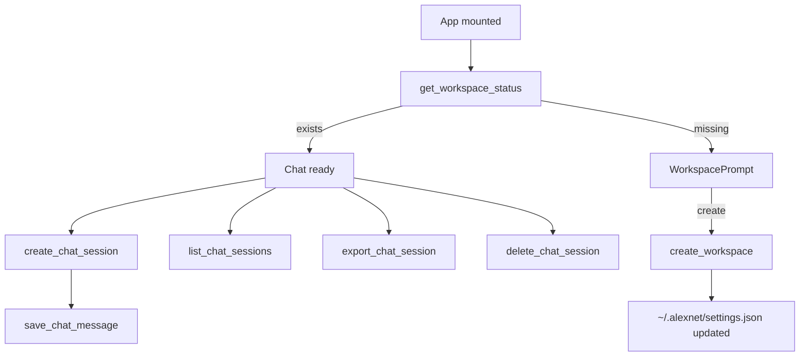

AlexNet Documentation Index

- Prompt Flow: See `Prompt_Flow Diagram.md` for the end-to-end path from user input in the UI to LLM calls, JSON planning, and command execution via Tauri.
- Multi‑Agent LLM Collaboration: See `Multi_Agent_LLM_Collaboration.md` for how the Orchestrator, Analyzer, Planner, Executor, and Validator coordinate.

Key Implementation Map
- UI entry: `src/views/ChatView.vue` wires the chat, progress updates, and command approvals. `src/App.vue` handles toolbar, settings, and workspace prompt.
- Agents: `src/services/agents/*` managed by `AgentManager`; orchestrated from `src/services/chainOfThoughtProcessor.ts`.
- LLM bridge: Rust `cerebras_chat`/`cerebras_completion` in `src-tauri/src/lib.rs` spawn `node scripts/cerebras/cerebras-client.cjs` (reads `CEREBRAS_API_KEY`).
- Safe command exec: `src-tauri/src/lib.rs` `execute_shell_command` validates commands, sanitizes args, limits PATH, and restricts directories.
- Tooling status: `src/services/tooling.ts` subscribes to `tools:availability` (emitted on startup) and `get_tool_availability`.
- Sessions: Stored under `~/.alexnet/<session-id>/chat.json` via Tauri commands in `src-tauri/src/lib.rs` and `src/services/sessionManager.ts`.
- Workspace: Default is `~/AlexNet`; UI prompts to create if missing. Path tracked in `~/.alexnet/settings.json`.

Operational Notes
- Frontend is Vue 3 + Vite; backend is Rust + Tauri. The app prefers delegating complex coding tasks to local CLIs (Codex/Claude) when available.
- Models and prompts are centralized per agent in `src/services/agents/baseAgent.ts` with overrides in `chainOfThoughtProcessor.ts`.

How Delegation Is Chosen
- Classify: `chainOfThoughtProcessor.ts` checks if a prompt is a coding task and estimates complexity (LLM-assisted + heuristics).
- Delegate: If coding and a CLI is available, it prepares `commands_to_execute` for Codex (preferred) or Claude. If no working directory is set, it requests one instead of running.
- Respond: If not a coding task, agents produce a conversational response without shell commands.
- Fallbacks: On errors or invalid JSON, it retries and/or uses the legacy CoT pipeline. See `src/services/chainOfThoughtProcessor.ts` (buildCodingCliHandoff and processUserMessage flows).

Diagrams

Multi‑Agent Flow (Mermaid)
```mermaid
flowchart TD
  U[User] --> CV[ChatView.vue]
  CV --> COT[ChainOfThoughtProcessor]
  COT --> AM[AgentManager / Orchestrator]
  AM --> AN[AnalyzerAgent]
  AM -->|if needed| PL[PlannerAgent]
  AM --> EX[ExecutorAgent]
  EX -->|LLM reply| UI[Final Response to UI]
  EX -->|commands| TA[execute_shell_command (Rust/Tauri)]
  TA --> UI
  COT -->|fallback| FCoT[Draft → Validate → Format → Parse]
```

Workspace & Session Lifecycle (Mermaid)


ASCII Versions

Multi‑Agent Flow (ASCII)
```
 +--------+    +-------------+    +----------------------+    +------------------------------+
 | User   | -> | ChatView.vue| -> | ChainOfThoughtProc. | -> | AgentManager / Orchestrator  |
 +--------+    +-------------+    +----------------------+    +------------------------------+
                                                                |           |             |
                                                                |           |             v
                                                                |           |       +-------------+
                                                                |           +-----> | Planner     |
                                                                |                   +-------------+
                                                                |                      (optional)
                                                                v
                                                         +-------------+
                                                         | Analyzer    |
                                                         +-------------+
                                                                |
                                                                v
                                                         +-------------+
                                                         | Executor    |
                                                         +-------------+
                                                            |      \
                                                            |       \  commands
                                                            |        \
                                                        LLM reply     v
                                                            |    +--------------------------+
                                                            v    | execute_shell_command    |
                                                         +-----+ |  (Rust/Tauri safety)     |
                                                         | UI  | +--------------------------+
                                                         +-----+             |
                                                                              v
                                                                             +-----+
                                                                             | UI  |
                                                                             +-----+

 [fallback] ChainOfThoughtProc. -> Draft -> Validate -> Format -> Parse -> Exec
```

Workspace & Session Lifecycle (ASCII)
```
 +-------------+
 | App mounted |
 +-------------+
       |
       v
 +----------------------+
 | get_workspace_status |
 +----------------------+
   | yes          | no
   v              v
 +---------+   +----------------+
 | Chat    |   | WorkspacePrompt|
 | ready   |   +----------------+
 +---------+            |
                         v
                  +-----------------+
                  | create_workspace|
                  +-----------------+
                         |
                         v
           +------------------------------+
           | ~/.alexnet/settings.json     |
           | updated                      |
           +------------------------------+

 From Chat ready:
   - create_chat_session -> save_chat_message
   - list_chat_sessions
   - export_chat_session
   - delete_chat_session
```
